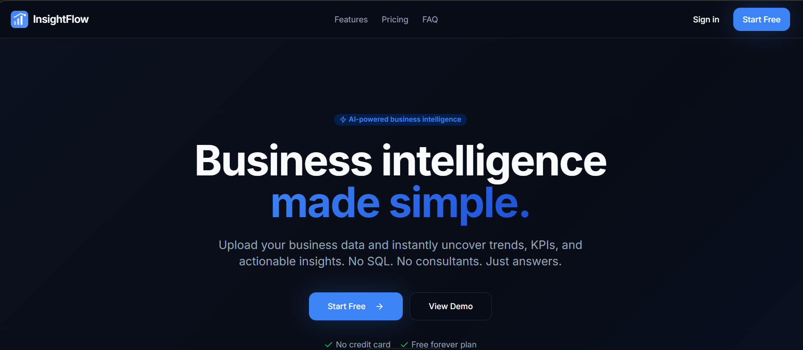

# XogArag

> See the story behind your data.

XogArag is a modern Business Intelligence platform built for teams that want to turn raw data into clear, actionable decisions. It combines an intuitive spreadsheet-like upload experience with automated data profiling, AI-generated summaries, interactive dashboards, and executive-ready reports.

Whether you are tracking revenue, monitoring customer cohorts, or comparing regional performance, XogArag gives you a single workspace to explore, visualize, and share insights without writing SQL or setting up complex infrastructure.

---

## Preview



---

## What XogArag Does

XogArag helps analysts, managers, founders, and operations teams make data-driven decisions faster. The platform ingests CSV and Excel files, automatically profiles the uploaded data, scores its quality, and surfaces KPIs, trends, and anomalies through a clean visual interface.

It is designed for organizations that outgrow spreadsheets but do not want the overhead of enterprise BI tools. Everything is accessible from the browser, works on desktop and mobile, and supports both light and dark modes.

---

## Who It Is For

- Startup founders who need quick visibility into revenue, customers, and growth.
- Analysts who want to clean and explore datasets without SQL.
- Managers who need dashboards and reports they can share with stakeholders.
- NGOs and small organizations that want to move from spreadsheets to structured reporting.

---

## Key Features

- **Executive Dashboards** — A unified view of the metrics that matter most to your business.
- **KPI Cards** — Track revenue, customer count, average order value, growth rate, and custom targets at a glance.
- **Revenue Analysis** — Understand how revenue changes over time, by product, region, or channel.
- **Customer Analytics** — Segment customers, identify cohorts, and measure retention and churn.
- **Product Performance** — Compare product lines, spot top performers, and identify underperforming SKUs.
- **Regional Insights** — Slice metrics by geography and uncover location-based trends.
- **Interactive Filters** — Drill into data by date, category, region, or any custom dimension.
- **Report Builder** — Generate and export polished PDF, Excel, and CSV reports.
- **Forecasting** — Project future trends based on historical patterns.
- **Export Reports** — Share reports with teammates or external stakeholders in one click.
- **Dark Mode** — A full dark theme for comfortable analysis in low-light environments.
- **Responsive Design** — Works on laptops, tablets, and phones without losing functionality.

---

## Tech Stack

### Frontend

The user interface is built with a modern React stack focused on performance, accessibility, and consistent design.

- **React** — Component-based UI library for building interactive interfaces.
- **TypeScript** — Strongly typed JavaScript that reduces runtime errors and improves maintainability.
- **Tailwind CSS** — Utility-first CSS framework for rapid, consistent styling.
- **shadcn/ui** — Accessible, composable UI primitives built on Tailwind and Radix.

### Backend

- **FastAPI** — High-performance Python framework for building REST APIs and handling data processing.

### Data & Analytics

- **Pandas** — Data manipulation, cleaning, and transformation.
- **NumPy** — Numerical computing and statistical operations.
- **Recharts** — Composable React charting library for dashboards and visualizations.

### Deployment

- **Vercel** — Frontend hosting and continuous deployment.

---

## Architecture

Data flows through XogArag in a simple pipeline:

Upload

↓

Processing

↓

Analytics Engine

↓

Business Insights

↓

Reports

↓

Export

Users upload a file, the platform parses and profiles it, runs analytics and AI summaries, and then presents the results in dashboards and reports that can be exported and shared.

---

## Project Structure

The codebase is organized into focused directories:

```text
frontend/        — React application, pages, layouts, and shared UI
backend/         — FastAPI server, data processing, and business logic
components/      — Reusable UI components and sections
charts/          — Chart components and visualization utilities
services/        — API clients, data processing services, and integrations
hooks/           — Custom React hooks for state, data fetching, and UI behavior
```

---

## Installation

Clone the repository, install dependencies, and start the development server.

```bash
git clone https://github.com/Diini03/xog-arag.git
cd xog-arag
npm install
npm run dev
```

After the server starts, open the local URL printed in the terminal to view the application.

---

## Roadmap

Planned features and improvements include:

- AI-generated insights and natural-language summaries.
- Team dashboards with shared views and permissions.
- Scheduled reports delivered by email.
- Email alerts for metric thresholds and anomalies.
- Forecasting improvements with confidence intervals.
- Dashboard sharing with public or password-protected links.

---

## Security

- Authentication protects access to datasets, dashboards, and reports.
- Secure file uploads with validation and size limits.
- Input validation on all API endpoints and file parsers.
- Protected APIs that require a valid session.

---

## License

MIT

---

Built with care by Diini Kahiye
