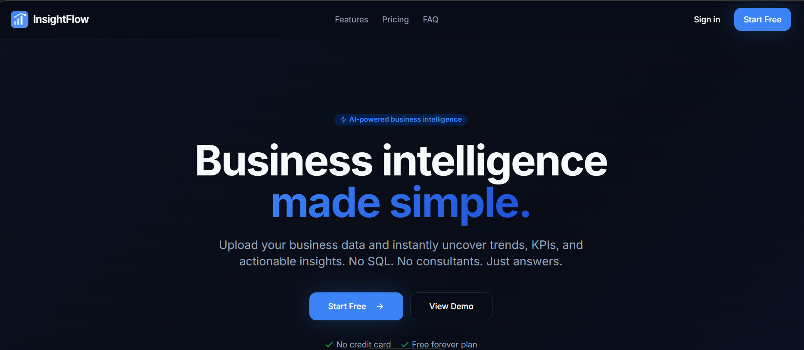

# XogArag

XogArag is an interactive discovery platform for data, AI and technology. It is not a dashboard and not a course. It is a place to visit out of curiosity: one interesting idea at a time, presented with large typography, a dark-first interface and things you can actually touch.



## What it is

Every day the site surfaces a small, deliberate set of content: a quote, a practical tip, a fact, a concept and a question. Alongside that sit interactive labs that let you manipulate a statistic and watch it respond, short games that test intuition rather than memory, and a curated news feed where every story keeps its original publication and link.

## Sections

- **Home** — an asymmetric discovery board with today's picks and entry points into everything else.
- **Today** — the deterministic daily set: quote, tip, fact, concept and question. The same for everyone on a given day.
- **Explore** — the full library, filterable by kind and by category.
- **Labs** — five educational simulations: Correlation, Regression, Distribution, Outliers and the Confusion Matrix.
- **Games** — Guess the Correlation, Spot the Outlier, Which Chart? and the Concept Challenge quiz.
- **News** — curated stories with publication, author, date and a short note on why each one matters.
- **Saved** — bookmarks kept locally on your device.
- **About** — the editorial rules behind the content.

## Content rules

Quotes are either attributed with a verifiable source or presented as original XogArag thoughts, never falsely attributed. Facts and news items carry a publication and a link. Labs are educational simulations and are labelled as such, not production models. Nothing invents a claim of fact.

## Interactive labs

Each lab renders with a lightweight custom SVG plotting layer rather than a chart library, so the simulations stay fast and fully controllable.

| Lab | What you manipulate | What you learn |
| --- | --- | --- |
| Correlation | correlation strength, noise | how a point cloud becomes a line |
| Regression | slope, intercept, noise | least-squares fit, residuals, R² |
| Distribution | mean, standard deviation | area under the normal curve |
| Outliers | data spread and extremes | z-score versus IQR flagging |
| Confusion Matrix | decision threshold | precision, recall and F1 trade-offs |

## Tech stack

- React 18 with TypeScript and Vite
- Tailwind CSS and shadcn/ui components
- React Router for routing, TanStack Query for async state
- Bricolage Grotesque for display type, Inter Tight for body text
- Lovable Cloud (PostgreSQL, authentication, edge functions) for optional accounts
- Local storage for bookmarks, scores and history — no account required

## Design

The interface is dark-first, built on a midnight palette with electric orange, mint, violet, data blue and AI purple as semantic accents. There is no sidebar and no admin chrome. Typography carries the hierarchy, motion is used sparingly, and every page is readable on a phone.

## Running locally

```bash
git clone <repository-url>
cd xogarag
npm install
npm run dev
```

The development server starts on port 8080.

```bash
npm run build     # production build
npm run preview   # preview the production build
```

## Project structure

```
src/
  components/
    common/    theme provider, logo, theme toggle
    site/      layout, navigation, footer, search dialog, cards
    labs/      the five interactive labs and the SVG plot helper
    games/     the four games
    ui/        shadcn primitives
  lib/
    content/   quotes, tips, facts, questions, news, catalog and types
    daily.ts   deterministic per-day content selection
    local.ts   bookmarks, scores and history in local storage
  pages/       Home, Today, Explore, Labs, Games, News, Saved, About, auth, 404
```

## Accounts

Accounts are optional. Sign-in exists for syncing saved items across devices; the entire site works without one, and progress is kept on the device by default.

## License

MIT.
