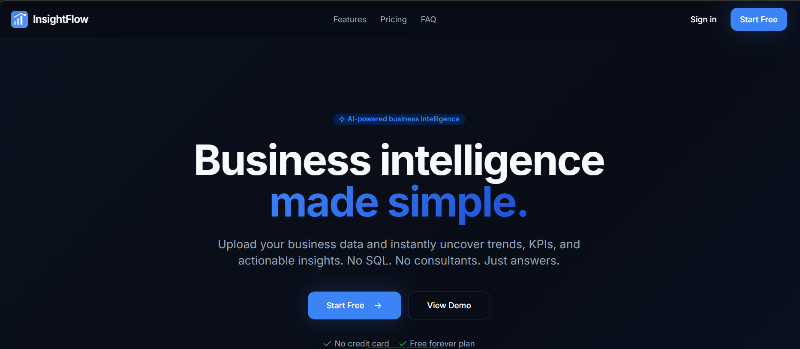

# Xog-arag — a data analyst's field log

*Xog-arag* (Somali: "one who has seen the record") is a personal field log kept by **Diini Kahiye**, a data analyst in Mogadishu. It collects quotes that stuck, notes worth keeping, honest concerns about AI, data science and machine learning, and a diary of real projects — written from practice, with the uncertainty left in.

It is a portfolio project, built to sharpen my own thinking: every entry is something I had to work out, and the log is where I keep it.

## What's inside

- **Log** — every entry, newest first, with a "recently read" strip so you can pick up where you left off.
- **Notes** — short working observations, with a signal / noise filter.
- **Quotes** — lines pinned to the page. Tap a card to flip it and read why it mattered.
- **Concerns** — longer pieces about where AI and analytics go wrong, each marked *speculative*, *observed in practice* or *still updating my view*.
- **Data diary** — projects with their status: ongoing, shipped or archived, linked to their repositories.
- **Archive** — the full record, grouped by month.
- **Kept** — entries you have marked with "keep", saved in your browser.
- **Entry pages** — each entry has its own page with related entries and earlier / later navigation.
- **Tags** — every label opens a page of all entries filed under it.
- **Quick find** — press `/` or Ctrl/Cmd-K to search every entry.

## Design

Strict black and white. Bricolage Grotesque for display, Inter Tight for reading, JetBrains Mono for metadata. Hairline rules, marginal notes beside each entry, inverted quote blocks, and a fixed index on the left edge like a notebook binding. A paper / ink switch toggles light and dark.

## Built with

React, TypeScript, Vite, Tailwind CSS and React Router.

## Author

Diini Kahiye — Mogadishu

- Portfolio: https://www.diinikahiye.online/
- GitHub: https://github.com/Diini03
- LinkedIn: https://www.linkedin.com/in/diinikahiye/
